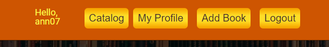

# 100 Books Challenge - React.js Project
 

## About the project
SPA for viewing and managing books.
___
 

## Public part

#### Home Page

 
 

#### Catalog
The catalog page displays all books from all users.

 

The search functionality is also available to everyone.

 

The details button takes the user to the details page.
When the user is not logged in the details looks like:

 

#### Navigation
The guests can see the links to the catalog, login and register pages.
 

 

#### Login
The users can login with email and password.

 

#### Register
The register format is standard with data validation applied.
 

 
 

___

## Private part

#### My Profile
The profile page shows all the books of logged in user.
It also displays information about the user's details and the number of books the current user has published.
The user's avatar changes according to the gender.

 

#### Create
Every logged-in user can publish books by filling in the creation form.

 

#### Owner Details 
When the user owns the book, they have access to the edit and delete buttons.

 

#### Non-Owner Details 
Non-Owners are able to like and comment on other books.

 

#### Navigation
When the user is logged in, the navigation looks like:

 

## The front-end part is built from scratch with:
* React.js
* HTML & CSS

## For the back-end is used:
[SoftUni Practice Server](https://github.com/softuni-practice-server/softuni-practice-server)

## Available Scripts

In the project directory, you can run:

 `npm start`

Runs the app in the development mode.\
Open [http://localhost:3000](http://localhost:3000) to view it in your browser.

